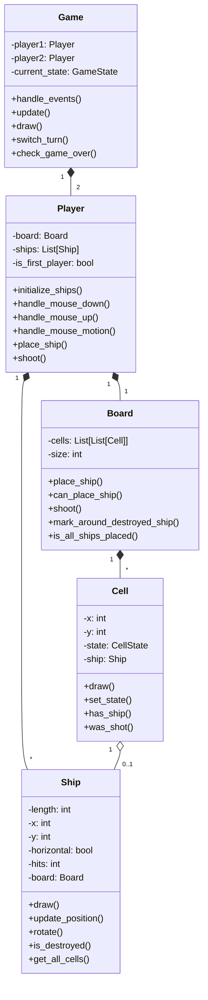
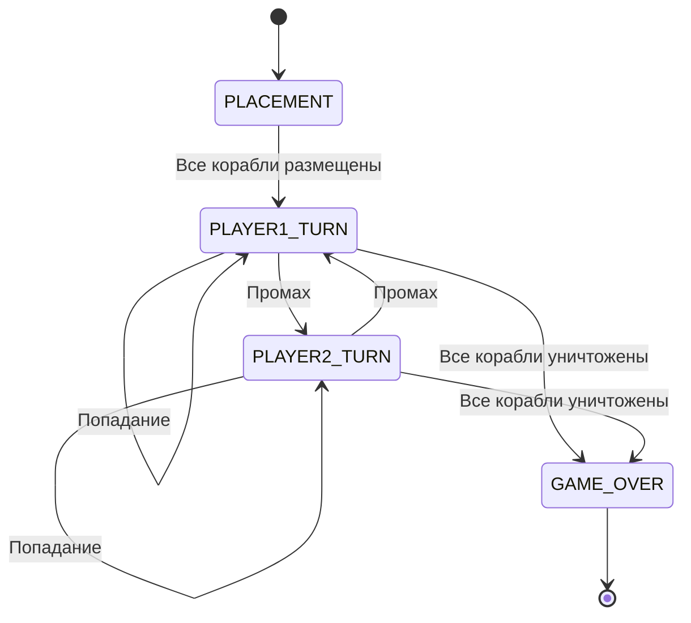
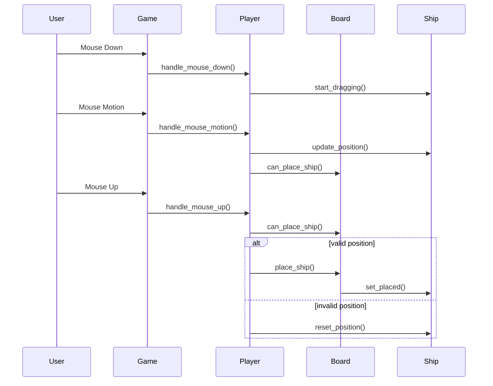
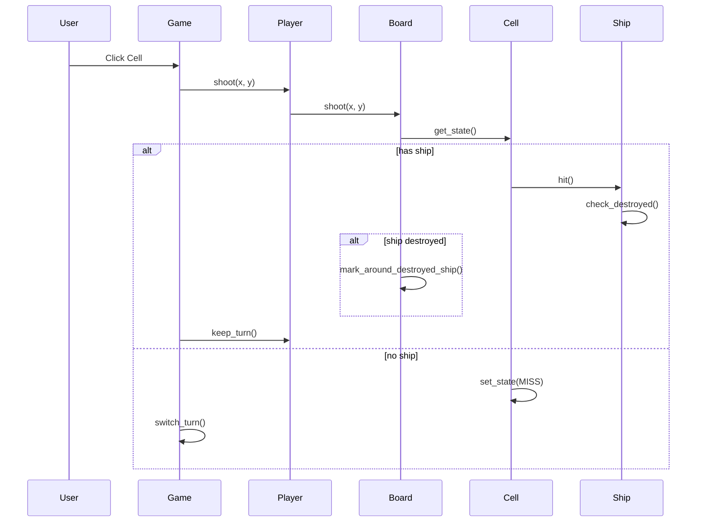
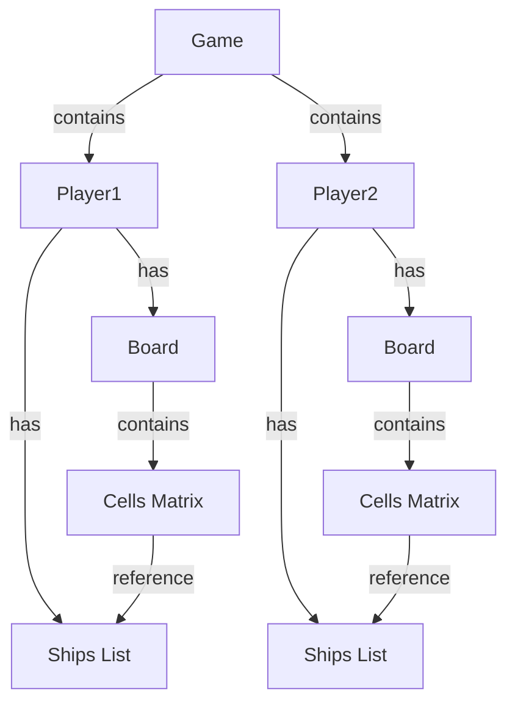
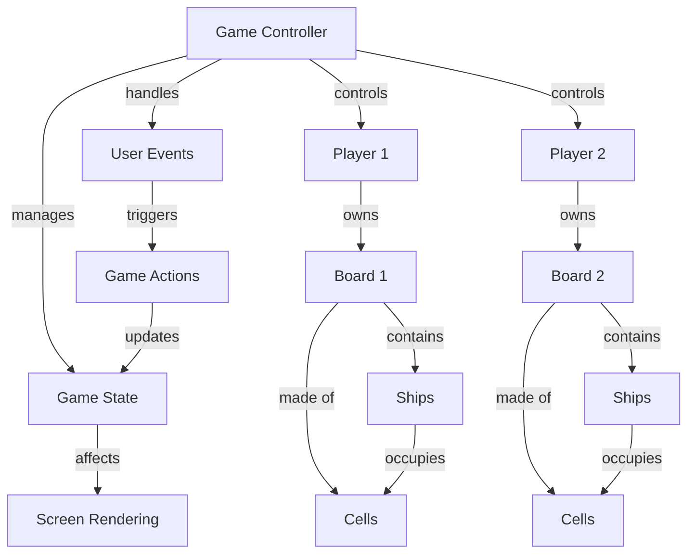

# Архитектура игры "Морской бой"

## Диаграмма классов

## Диаграмма состояний игры

## Диаграмма последовательности размещения корабля

## Диаграмма последовательности выстрела

## Структура данных

## Схема взаимодействия компонентов

